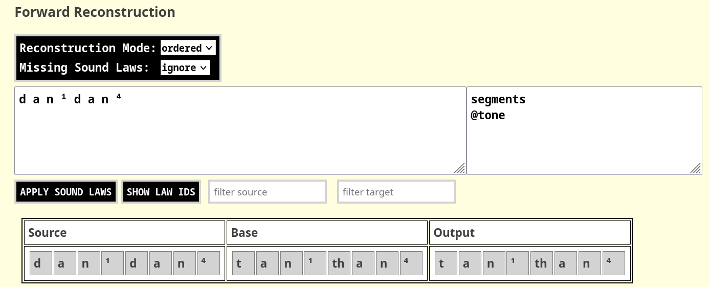
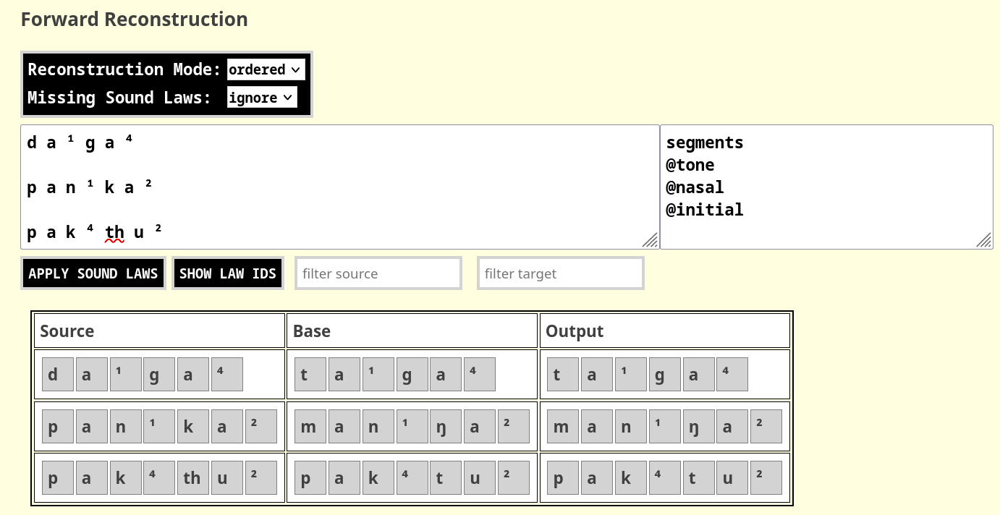

### 1 Overview

MISOl consists of four major components accessible in four different tabs of the web interface. The first component defines sound classes and sound laws. The former allow to group sounds into arbitrary units, and the latter allow to define how sounds in an ancestral language change into sounds in a descendant language in a certain context. The second component allows to convert words in the ancestral language into words in the descendant language (also known as "forward reconstruction"), and the third component allows to guess from which words in the ancestral language a given word in the target language has evolved. The fourth component allows to import and export data in text form, enabling users to store their analyses, parse the data with additional software tools, or to compare different approaches to solve the same problem in phonological reconstruction. The components are summarized in Figure 1.

{ width=90% }

### 2 Defining Sound Classes (Tab "Classes and Laws")

The table of sound classes defines sounds in a very simple way, by assigning
one or more sounds or sound classes to a certain sound class label on each
line. Sound classes are read in from the first to the last line and definitions
are stored at the time a line is parsed. As a result, sound class assignments
can be combined, and an existing sound class can be assigned to another
class.

The assignment of one or more sounds or sound classes to a given sound class is represented in the form:

<div class="mycode">

```bash
name = sound1 sound2 sound3
```
</div>

The `name` of a sound class must be alphanumeric, similar to typical Python
variables, and should not start with a number. The `=`-sign must have a space to the left and to the right. All
sounds (or sound groups referenced by invoking an existing sound class name)
must be separated by a space.

Thus, the following examples for sound class definitions are all *wrong*:

<div class="badcode">

```bash
name=sound1 sound2 sound3
name =sound1 sound2 sound3
name= sound1 sound2 sound3
1name = sound1 sound2 sound3
```

</div>

Internally, a sound class is an ordered list of sounds. By assigning sounds to
a sound class, the sounds are made available to the MISOL system to act
as source and target of sound change processes and to be referenced in sound
laws. In addition to referencing groups of sounds with the help of sound class variables,
all individual ("terminal") sounds are also represented in as sound classes. The difference is that these classes have the same label as the sound iself and that they contain only one element (the sound they refer to).


Furthermore, each final symbol that is identified as a sound
(and not a sound class name) by the MISOL system is also assigned to its own
class with one single manner. Thus, the following line will define as many as 5
internal sound classes, of which four have one single member, and the first
targets the four only sounds in the system.

```
my_class = a b c d
```

Thus, internally, this will result in the following key-value representation:

<div class="mycode">
  
```json
{
  "my_class": ["a", "b", "c", "d"],
  "a": ["a"],
  "b": ["b"],
  "c": ["c"],
  "d": ["d"]
}
```

</div>

When parsing sound laws, MISOL automatically checks for sounds that have not
been referenced in the sound class table and adds them as individual sounds to
the table of sound classes. As a result, you do **not need to define sound
classes in order to define sound laws**. 

In order to check which sound classes have been defined in MISOL, click on the
SHOW CLASSES AND LAWS button, after having inserted your sound class
definitions and your sound laws in the *Classes and Laws* tab. A table will
open and present you all sound classes that have been defined, including both
those classes that you defined actively, as well as those classes that were
inferred automatically from the sound laws you defined.

When you check the sound classes in MISOL, you will see that the list of
classes shows three sound classes in the beginning, which are provided
independently of what you have defined or not. These reserved classes, are the
symbols `^`, `$`, and `-`. `^` refers to the beginning of a sequence and can be
used in the context string of a sound law. The same holds for `$` referring to
the end of a sequence. `-` refers to a specific sound law in which an element
is lost (rather than being replaced by something). It can also be used as a
source sound (in the case of epenthesis, which must be actively modeled) or as
a target sound in a sound law. Other than for this specific purpose, the
symbols should not be used.

Sound classes are a way to model distinctive features that define individual
sounds. The difference between feature-bundle representations for sounds in
sound change models is that features are flexibly defined on the fly, and
modeled rather as "tags" of individual sounds, or a shortcut to reference the
sounds that are tagged with a certain sound class name in an ordered manner. In
our opinion, this comes quite close to the way feature bundles are used
intuitively by linguists so far, since one can define one's sound system in a
convenient manner, and provide major distinctions that may play a role in sound
laws, such as voicing distinctions of consonants:

<div class="mycode">
  
```
voiced = b d g
voiceless = p t k
```

</div>

Another important aspect of sound classes is that they can be used as a
shortcut for a group of sounds in sound laws, which often consist of an
abstract set of independent sound changes, rather than an individual sound
change that occurs in one context alone. As a result, one can refer to both
individual sounds and to sound classes in the sound law descriptions of
MISOL.

As a further note on the way in which sound classes are handled in MISOL,
consider the following assignments:

<div class="mycode">
  
```
voiced = b d g
voiceless = p t k
consonant = voiced voiceless m n ŋ
``` 

</div>

This translates internally to the following major sound class representations:

<div class="mycode">
  
```json
{
  "voiced": ["b", "d", "g"],
  "voiceless": ["p", "t", "k"],
  "consonant": ["b", "d", "g", "p", "t", "k", "m", "n", "ŋ"]
}
```

</div>

Thus, if a sound class like `voiced` has been assigned to a list of sounds, the
label can be reused in order to assign the same group of sounds to another
sound class. Internally, all sound classes are only represented as a group of
terminal sounds, and only sound laws can be reused in assignments if they have
already be defined. As a result, the following order of assignments would be
problematic:

<div class="badcode">
  
```
consonant = voiced voiceless m n ŋ
voiced = b d g
voiceless = p t k
```

</div>

Since `voiced` and `voiceless` have not been introduced yet with their target
group of sounds, the interpreting code of MISOL would treat them as individual
sounds (which can be represented by any string combination, provided it does
not contain a space). Invididual sounds, however cannot be assigned to another
group of sounds, since they are internally assigned to a group of one sound
only, so the program throws a warning here and ignores the corresponding line.

Since MISOL does not care how you define your sounds, it offers the possibility
to work with groups of sounds as well as with individual sounds when dealing
with sound change. In order to make sure that we distinguish groups from
individual sounds, the recommendation is to use a dot `.` between sounds in a
sound sequence in order to indicate that one is not dealing with individual
phonemes. Thus, the final or rhyme of a Chinese word like `[`kwaŋ`]` could then
be conveniently written as `a.ŋ`. MISOL, however, will treat this sequence of
grouped sounds as an individual sound class (potentially a terminal one) and
not assign it a specific semantics. 

Since sound classes are ordered lists of sounds, nothing speaks against it if you assign the same sound multiple times to one and the same sound class. This may be important in cases where *mergers* are described in complex sound laws that deal with more than one input sound. 

There are two symbols which are automatically defined as sounds, which cannot be assigned to sound class groups: `^` represents the beginning of each word and `$` the end. `#` is reserved as a comment marker. 

### 3 Defining Sound Laws (Tab "Classes and Laws")

A sound law is an abstract formula that shows how one or more sounds in an ancestral language are converted to one or more sounds in a descendant language. It has the general formula:

<div class="mycode">

```shell
source > target / context
```

</div>

The number of source sounds and target sounds must be identical and the context is optional and can be omitted:

<div class="mycode">

```shell
source > target
```

</div>


The change marker `>` must be preceded and followed by a space. So the following lines would be erroneous and lead to errors.

<div class="badcode">

```shell
source> target
source >target
source>target
```

</div>

The same strict rules apply for the marker separating the context, the slash, which must be preceded and followed by at least one space. So again, the following lines will all yield errors and as a result, the line will be ignored.

<div class="badcode">

```shell
source > target/ context _
source > target /context _
source > target/context
```


</div>

#### 3.1 Source and Target in Sound Laws

Source and target can be either a single sound, sound class, or list of sounds
(indicated by square brackets) or a sequence of sounds. If a sequence of sounds
is provided, this will be interpreted internally by invoking two or more
separate sound laws. Thus, writing

<div class="mycode">

```shell
a b > [c d] / x _ y
```

</div>

is equivalent to writing

<div class="mycode">

```shell
a > c / x _ b y
b > d / x a _ y
```

</div>

Allowing to define consecutive sounds is thus a mere shortcut but it can come
in handy in those cases where it seems difficult to define complex sound laws.


If you pass a sound class, a single sound, or a list of sounds does not make a
difference. Thus, if you have defined a sound class `ptk` as shortcut for the
sounds `p`, `t`, and `k`, the following two statements are equivalent:


<div class="mycode">

```shell
ptk > ptk
[p t k] > [p t k]
```

</div>

The same holds for sequences of sounds:

<div class="mycode">

```shell
ptk ptk > ptk ptk
[p t k] [p t k] > [p t k] [p t k]
```

</div>

Mixing is also possible.

<div class="mycode">

```shell
ptk [p t k] > [p t k] ptk
```

</div>

Note, however, that it is essential that the source and the target always contain the *same amount of sounds* and the *same amount of positions*. If you want to indicate the loss of a sound, use the `-` as gap marker:

<div class="mycode">

```shell
ptk ptk > ptk [- - -]
```

</div>

Note in this example, that you cannot write a single gap symbol, but must
assemble a group (or define a sound class with the group before), since we
require to have one target sound for each source sound and vice versa. This
means also, that you must repeat a sound when using sound class notations to
formulate sound laws, where a merger happens.

<div class="mycode">

```shell
[p t k] > [p p p]
```

</div>

If you want to indicate that one sound turns into two sounds, which could happen in the case of epenthesis, you must provide the two sounds that replace the one sound in the original separated by a dot, as follows:

<div class="mycode">

```shell
n > n.d / _ r [a e i o u]
```

</div>

MISOL will internally replace the sound by the sequence `n.d` in the respective context, but the final output will provide the sound in merged form. 
 
MISOL will in all cases represent sound laws individually, on the basis of one source sound corresponding to one target sound in one individual context. 


#### 3.2 Context in Sound Laws

The context typically has the form:

<div class="mycode">

```shell
left_context _ right_context
```

</div>

Here, `_` represents the source sound. Both left and right context can be omitted.

<div class="mycode">

```shell
left_context _
_ right_context
```

</div>

Context in left and right context is identically defined by a segmental
representation of the sound sequence proceeds to the left in the left context
and to the right in the right context. In this way, theoretically even very
long ranging contexts can be modeled. If one wants to change an `[s]`
followed by `[p, t, k]` and a vowel to `[ʃ]`, one can write:

<div class="mycode">

```shell
s > ʃ / _ [p t k] vowel
```

</div>

Here, the square brackets `[` and `]` are used to indicate that the three
sounds `p`, `t`, and `k` represent a group that can alternatively occur in the
second position following the source sound. A full-fledged toy example that
would model that an `s` becomes voiced when followed by a vowel and turns into
a `ʃ` when followed by a consonant and a vowel, one could define the following
sound classes:

<div class="mycode">

```shell
consonant = p t k b d g s z ʃ
ptk = p t k b d g
vowel = a e i o u
```

</div>

These could then be used in four sound laws:

<div class="mycode">

```shell
s > ʃ / _ [p t k] vowel
s > z / _ vowel
p t k b d g > p t k b d g
vowel > vowel
```

</div>

These would turn a word like `s t a b` into `ʃ t a b` but would turn `s a b` into `z a b`. Defining groups of sounds with square brackets can be done in a very flexible manner, and even sound classes can be placed inside brackets in order to form new groups of sounds. One can, for example, define two groups of sound classes for voiced and voiceless sounds as follows:

<div class="mycode">

```shell
ptk = p t k
bdg = b d g
```

</div>

These can then be used in combination in a sound law.

<div class="mycode">

```shell
a > e / _ [ptk bdg]
```

</div>

#### 3.3 Using Tiers in Sound Laws

MISOL is based on the idea that a sound sequence is often best represented as a sequence consisting of multiple *tiers* (similar to multi-tiered annotation of texts in linguistic examples, such as interlinear-glossed text), that is, a matrix in which different aspects of the sequence are treated in segmental form. Tone, for example, can often be thought of as representing the whole syllable of a word in some tone languages, rather than only one of the sounds in the syllable, or the vocalic nucleus. 

MISOL supports using multi-tiered sequences in two ways. First, one can define multi-tiered sequences in a very flexible fashion by just providing a matrix of symbols with as many tiers as one wants to use instead of using only one tier alown. A word in a tonal language, consisting of two syllables with two distinct tones, could thus be represented in the following form:

<div class="mycode">

```shell
p a ŋ t a n
¹ ¹ ¹ ² ² ²
```

</div>

In a similar way, one can represent stress in a word, e.g., by using the symbol 1 for stressed syllables and the symbol 0 for unstressed syllables.

<div class="mycode">

```shell
f a t ə r
1 1 0 0 0
```

</div>

Different tiers apart from the first segmental tier (called `segments` in MISOL) can be addressed in the context definitions in all positions by using the symbol `@`, followed by the name of the tier, in front of the group of sounds (marked by square brackets), preceding or following the sound in question (or the sound itself). Thus, to indicate that an unstressed `[t]` turns into a `[d]`, one can write:

<div class="mycode">

```shell
t > d / @stress[0]_
```

</div>

When applying this sound law in forward reconstruction, one must provide both tiers (the segments tier and the stress tier) and pass the names of these tiers in the text field to the right of the field where one inserts the sound sequences to be modified, as shown in Figure 2.

{ width=90% }

The most common use-cases for sound laws with tiers is to define the specific tier value that holds for the segment that one intends to change (such as we have seen in the example). Other use cases, however, are also possible, when thinking of cases where a certain tier value holds for preceding or following sounds. 

Instead of actively *defining* and *passing* new tiers for individual segmental representations of sound sequences, one can also make use of inbuilt functions in MISOL that *compute* tiers automatically. An example is again the use of a specific tonal tier (called `tone`), which is computed from the segmental representation of tones using superscript letters at the end of each syllable. Thus, passing a sound sequence such `p a ŋ ⁵ d a n ¹` will automatically yield a virtual representation such as the following one internally in the MISOL program:

<div class="mycode">

```shell
p a ŋ ⁵ d a n ¹
⁵ ⁵ ⁵ ⁵ ¹ ¹ ¹ ¹
```

</div>

As a result, tonal tiers can be used, as long as the tone values are indicated by superscript numbers at the end of the syllable in each sequence. In order to invoke these tonal tiers, one must indicate this actively when using the forward reconstruction method (or the backward reconstruction), by adding `@tone` as an additional tier, as shown in Figure 3, assuming the following sound law:

<div class="mycode">

```shell
d > t / @tone[¹]_
```

</div>


{ width=90% }

Apart from tonal tiers (called `tone` in MISOL), MISOL currently offers three more tiers that can be automated, one tier that checks for the nasality of whole words (returning `1` if a words contains a nasal sound or a nasal vowel, and `0` otherwise), one tier for the initial sound in a word (returning the initial sound for each letter in the word, called `initial`), and one tier that handles the stress patterns of the word (requiring a specific annotation that uses stress markers to mark syllable boundaries in an explicit manner).

As an example, consider the following three sound laws that all use one of the three automated tiers.

<div class="mycode">

```shell
d > t / @tone[¹]_
p > b / @initial[k]_
b > m / @nasal[1]_
```

</div>

Figure 4 shows, how these can be applied to individual sequences, and where in the tool one needs to provide the information on the tiers that one intents to use.

{ width=90% }

In order to handle stress, stress must be marked in a specific fashion that differs from the current handling in the International Phonetic Alphabet. First, stress markers must be placed in front of every syllable in a word, not only in front of stressed syllabes. Second, stress markers receive their own slot, they should be separated by a space from the rest of the sequence. Third, stress markers must start with either the IPA stress marker `ˈ` or the quotation mark `'` (for convenience), or the secondary stress marker `ˌ`, but stress markers can be expanded by adding arbitrary symbols, allowing to mark different kinds of stress, such as "unstressed by following a stressed syllable" (which would be needed for Verner's law. Thus, when defining the following sound law, one can handle Verner's law as well, by passing the sequence `ˈ f a ˌ t e r`, in which we assume that the secondary stress marker refers to unstressed syllables following a stressed syllable.

<div class="mycode">

```shell
[p t k] > [f θ x] / @stress[ˌ]_
```

</div>

#### 3.4 Consecutive Sound Laws

The basic idea of MISOL is that sound laws often happen at the same time. For this reason, MISOL does not chain individual sound laws in order in order to let them derive a new sequence to which the next sound law is applied, but rather applies them all at once to the original context. 

In most cases, these synchronous sound laws are sufficient and much easier to handle than consecutive sound laws. In some cases, however, it is clear that sound laws were active at different stages, called *layer* in MISOL. Thus, MISOl allows you to "layer" your sound laws by assigning them to different layers which are then executed in the order in which you provide them. As a simple example, consider how Latin *generu-* became *gendre* in French. While one could model this change in synchronous sound laws in many ways (for example also by just replacing *e* by a *d* when occurring between *n* and *r*), it is much easier and also closer to actual sound change to think of two different major changes that took place here. First, *generu* becomes *genru*, and then the epenthetic *n* emerges.
 
In order to model these sound laws in MISOL, you must assign individual sets of sound laws to a layer, by adding the layer name, placed in an equal sign, separated with a space, to the left and the right of the layer label.

<div class="mycode">

```shell
= Layer 1 =
e > - / n _ r

= Layer 2 =
n > n.d / _ r [a e i o u]
```

</div>

When applying these sound laws, MISOL will display all internal results, allowing you to track all intermediate forms that lead to the final form proposed by the tool, according to your sound laws.


### 4 Forward Reconstruction (Tab "Forward Reconstruction")

Forward reconstruction in MISOL is available in different flavors. What all approaches have in common is that MISOL first uses all available information on sound classes and sound laws in order to construct a virtual context window in which sound laws are supposed to take place. This window can be thought of as a multi-tiered sequence representation in which context is not handled on the horizontal axis, but precomputed for each segment in a sequence and represented in individual tiers, each corresponding to one specific context. For a sound law by which voiceless initials are voiced in intervocalic positions, for example, we would need two tiers apart from the base tier in order to represent context to the left of each segment and context to the right of each segment. The sound law could be represented as follows in MISOL (without using any sound classes), we add additional sound laws for completeness.

<div class="mycode">

```shell
[p t k] > [b d g] / [a i u] _ [a i u]
[b d g] > [b d g]
[a i u] > [a i u]
```

</div>

When dealing with a new sequence `b a p a` now, MISOl has already inferred from the sound law, that we need two additional tiers, and will now represent the new sequence accordingly, by providing for each segment its right context and its left context.

Tier | 1 | 2 | 3 | 4 
--- | --- | --- | --- | ---
Segments | b | a | p | a
Segments`_`Left | ^ | b | a | p 
Segments`_`Right | a | p | a | $

From the sound laws shown above, MISOL will construct vectors that represent individual contexts. These sound laws are based on the Cartesian product of the different sounds that can appear in the left and the right context and thus capture all eventualities, as shown in the table below, that shows the individual vectors for the three sound laws (in abbreviated form).

<div class="mytable">

ID | Law | Segments | Segments`_`Left | Segments`_`Right | Target
--- | --- | --- | --- | --- | --- 
1   | 1 | p | a i u | a i u | b
2   | 1 | t | a i u | a i u | d
3   | 1 | k | a i u | a i u | g 
4   | 2 | b | Ø | Ø | b
5   | 2 | d | Ø | Ø | d
6   | 2 | g | Ø | Ø | g
7   | 3 | a | Ø | Ø | a
8   | 3 | i | Ø | Ø | i
9   | 3 | u | Ø | Ø | u

</div>

When iterating over each position in the multi-tiered sequence, MISOL will try to find which of the laws (as shown in the table) provides a vector that matches the current vector in the sequence. The symbol `Ø` is a wildcard marker and matches with every sound. For our example, we can contrast the actual tiers with the precomputed individual sound laws as shown below. 

<div class="mytable">

Tier             | 1    | 2   | 3   | 4
---              | ---   | --- | --- | ---
Segments         | b  | a   | p    | a
Segments`_`Left (Source / Context) | ^ / Ø | b / Ø  | a / **a** i u  | p / Ø
Segments`_`Right (Source / context) | a / Ø | p / Ø  | a / **a** i u | $ / Ø
Sound Law / ID   | 2 / 4     | 3 / 7   | 1 / 1   | 3 / 7
Target           | b     | a   | b   | a

</div>

This is the major procedure used by MISOL in order to turn one source sequence into one target sequence. The method (1) precomputes the context for the sequence, which allows it to (2) iterate over each position regardless of the order, searching for matching patterns and their corresponding output.

#### 4.1 Strict and Ordered Reconstruction Mode

The procedure as outlined here is what is called the "strict" mode in MISOL
when using forward reconstruction. It is called "strict" with respect to the
mode of reconstruction, since it does not tolerate that different sound laws
match the same context and yield different output (MISOL will explicitly mark
these cases). Users can choose between the strict mode and the "ordered" mode, in which the matching process is modified in such a way that in the case of competing sound laws, the law that was defined first, wins. This makes coding sound laws much more convenient, since one can first define a very strict law and later define a general law that would hold for all other cases not touched by this first law. 

<div class="mycode">

```shell
s > ʃ / _ [p t k]
s > s
```

</div>

When passing a sequence `s p a s a` to this sound law, it would yield the output `s|ʃ p a s a` in strict mode, and `ʃ p a s a` in ordered mode, using the pipe to indicate competing sounds (see [List et al. 2023](https://aclanthology.org/2023.lchange-1.3) for this notation). 

#### 4.2 Treatment of Missing Sound Laws

Scholars typically omit the "boring" sound laws from their descriptions, specifically those cases of sound change, where no sound change happens. Thus, we rarely find a sound law as the following in the literature.

<div class="mycode">

```shell
t > t
```

</div>

MISOL tolerates the omission of not providing sound laws in those cases where sounds don't change. The *Forward Reconstruction* tab offers users to select whether missing sound laws should be *marked* or *ignored*. If they are ignored, the original sound is used unchanged. If they are marked, the sound will be preceded by an exclamation mark and marked in red. 

#### 4.3 Tiers in Consecutive Sound Change Processes

At the moment, you can only pass explicit tiers (such as accent) once. Since their main purpose is to be able to explain the initial change, they cannot be used in consecutive sound law processes, since this would require us to add a routine by which tiers from a source word turn into tiers from a target word. +++Using computed tiers is not yet implemented by will be available at some point.+++


### 5 Backward Reconstruction

### 6 Import and Export
